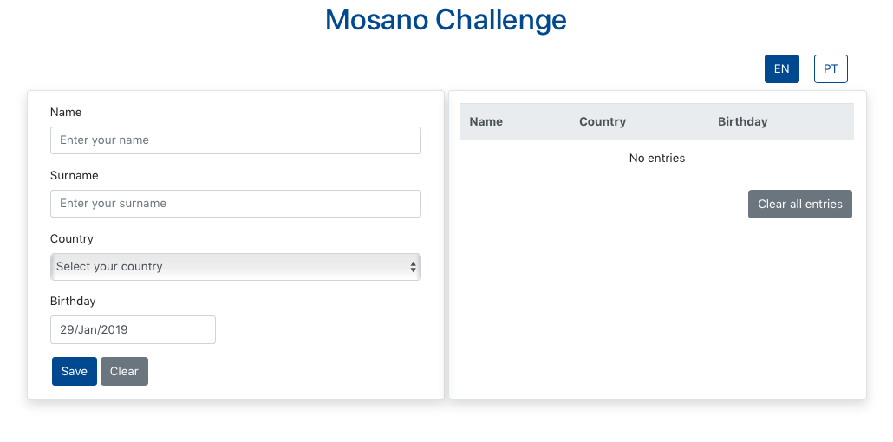

# mosanoChallenge

This web app was made in ReactJS with the purpose to save and list users. MosanoChallenge support i18n - english and portuguese.

### Some implementation details
To build this app was used one react library, bootstrap and [countries API](https://restcountries.eu/rest/v2/all) to list all countries in select row.
* [Bootstrap](https://react-bootstrap.github.io/getting-started/introduction/);
* [react-localization](https://www.npmjs.com/package/react-localization);
All the users data will be persist on browser storage. 

### Installation & Development

1. clone this repo: `git clone https://github.com/renatogslopes/mosanoChallenge.git`
2. `cd mosano-challenge`
3. `npm install`
4. run `npm start` from a terminal and it'll run on [http://localhost:3000](http://localhost:3000) 
5. The app will automatically reload if you change any of the source files.

## .Weather - What you'll see. 
Main Page - Before any user saved.

Main Page - After user saved. 

## To improve in the future

1. Implement the Redux.

## Author
Renato Lopes 

